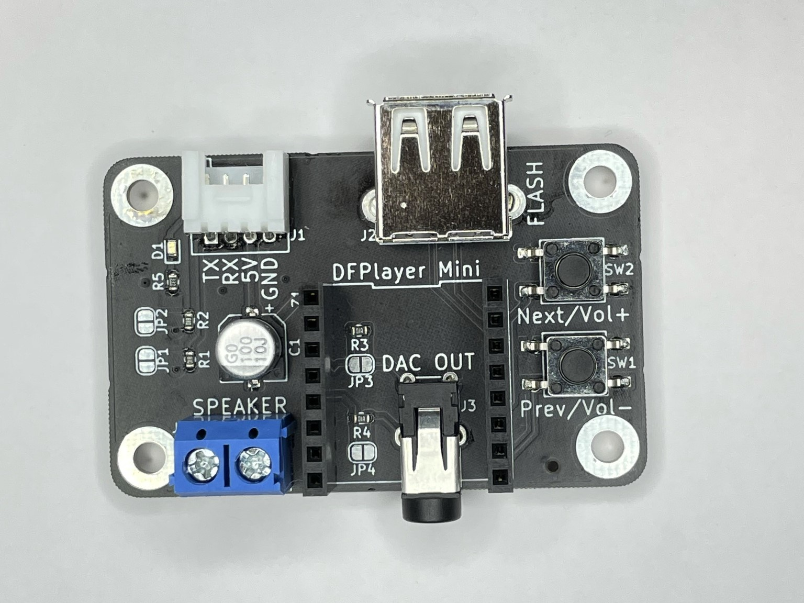

# PCB-Grove-DFPlayer-Mini
a PCB to connect DFPlayer-Mini through Grove Connector

# DFPlayer-Mini 用 GROVE 接続基板
MP3 演奏モジュール DFPlayer-Mini を GROVE コネクタで簡単に接続するためのプリント基板です。フラッシュメモリ用 USB コネクタ、モニタースピーカー端子、ステレオ出力を備えます。押しボタンスイッチが 2 個あり、次の曲・前の曲の選択、長押しで音量増・減ができます。

 

## 特徴
- GROVE ケーブルで M5 シリーズのポート (UART 設定) に直結できます。
- 3.5mm ミニジャックからステレオ音声を出力できます。
- ターミナルブロックにスピーカー（モノラル）を接続できます。
- USB-A コネクタからフラッシュメモリの楽曲を演奏できます。
- 押しボタンスイッチが 2 個あります。次の曲・前の曲、長押しで音量増・減ができます。

## ご注意
- DFPlayer-Mini（スイッチサイエンスSKU:4291）は付属しません。
- GROVE の電源は 5V 専用です。信号 (UART) は 3.3V です。
- USB-A コネクタは USB フラッシュメモリ専用です。
- 5V 信号ヘの接続を考慮し、TX, RX に保護抵抗 (1kΩ) を入れています。JP1(TX), JP2(RX) をハンダでショートすることでバイパスできます。TX は 3.3V で出力する方向ですので、保護抵抗は不要です。実験中の接続ミスなどを考慮して使用することもできます。
- ステレオ出力には、保護抵抗 (100Ω) を入れています。出力レベルが不足する場合、JP3(R), JP4(L) をハンダでショートすることでバイパスできます。
- プリント基板単体の完成品です。ケースや足はありません。部品の足が剥き出しのため、絶縁材や四隅の穴にスペーサを取り付けるなどして、負傷、静電気破壊、机の傷などを防止ください。

## サンプルプログラム

DF-029.ino は、M5Atom 用です。M5Atom の GROVE ポートに DFPlayer-Mini を接続します。5 秒ごとに次の曲を演奏します。M5Atom のボタンを押すと、microSD・USB フラッシュの選択が切り替わります。

## 内容物

